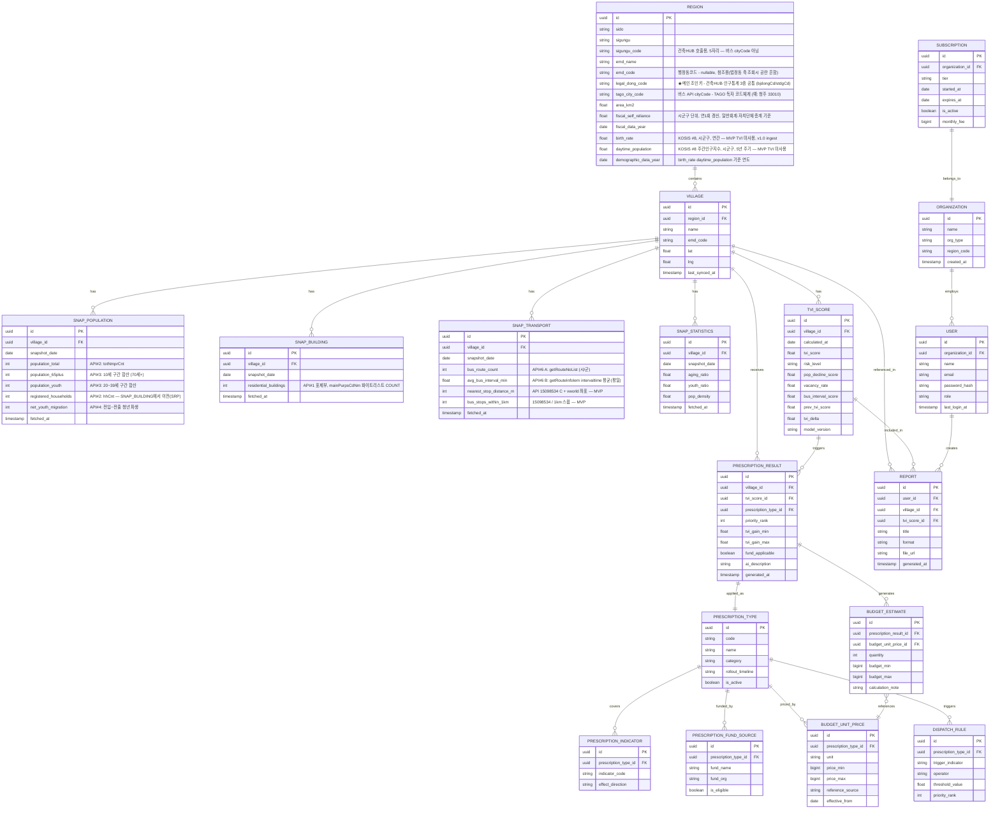

# TownPulse ERD — MVP 버전 v6.1

> 충북 마을생존 AI 의사결정 플랫폼 | Pulse Lab | 2026년 6월
> **버전 규칙:** 마이너 0~9 · `v5_9`→`v6_0` (v8 계열은 `v9_0`으로 메이저 갱신 — 백엔드 SSOT)
> 대회 제출 기준 · 실연동 **8개 API** + 정류소 **15098534** (MVP) · 처방 라이브러리 5종
> **v5.1 (2026-06-21)** — `birth_rate`·`daytime_population` → REGION
> **v5.2 (2026-06-21)** — §10-9 정류장 1km 알고리즘(15098534+노선카탈로그) · `tago_route_counts_chungbuk.json`
> **v5.3 (2026-06-21)** — §10-8b `mainPurpsCdNm` 화이트리스트 판정 사전(7종) · 기숙사 제외 · unmatched 감사 로깅
> **v6.0 (2026-06-21)** — v5.4 내용 계승 · 버전 체계 `v6_0` 갱신 (마이너 0~9)
> **v6.1 (2026-06-21)** — `townpulse_user.password_hash` (bcrypt) · 로그인 `org_id`=organization.id · §12-1c
> 참고 스펙: `TownPulse_백엔드_MVP_개발정의서_v9_5.md`

---

## v5 변경 배경 (v4 → v5)

| 항목 | v4 | v5 |
|---|---|---|
| 버스 ingest | 2단계 (노선만) | **A/B/C 3단계** — 노선 2단계 + **15098534** 정류소 (vworld 좌표 선행) |
| `REGION.sigungu_code` | 주석에 "버스노선" 혼재 | **건축HUB 전용** — 버스는 `tago_city_code`만 |
| PopulationAdapter #3·#4 | `fields_confirmed: False` | ✅ probe JSON 키 확정 (`town.www/_docs/api_samples/`) |
| 검증 표 | #3·#4·#6 ⚠️ | ✅ probe 확정 / **15098534 probe 확정** |
| TVI | 미기재 | `bus_stops_within_1km == 0` 또는 `nearest_stop_distance_m > 1000` → `bus_interval_score = 0` |
| 텍스트 생성 | Claude API | **Gemini API** (v8 정합) |

v4.1에서 반영된 **API#6·#7 버스 통합**은 v5에서 유지 (동일 `BusRouteInfoInqireService`).

## v5.1 변경 (v5.0 → v5.1)

| 항목 | v5.0 | v5.1 |
|---|---|---|
| 건축HUB 요청 | ⚠️ 추정 | ✅ `sigunguCd`+`bjdongCd`+페이징 확정 (`bun`/`ji` 생략 시 법정동 전체) |
| `birth_rate` | `SNAP_POPULATION` (미확정) | **`REGION`** — KOSIS #8, 시군구, v1.0 ingest |
| `daytime_population` | `SNAP_POPULATION` (미확정) | **`REGION`** — KOSIS #8, 시군구·5년 주기, v1.0 ingest |
| MVP TVI | — | 두 지표 **미사용** 유지 (v1.0 시군구 보정계수 검토) |
| v1.0 빈집 검증 | 국토부 빈집실태조사(막연) | **KOSIS `DT_1JU1512` 시군구** (`VACANCY_VERIFICATION`) |

### API 승인 현황 (8/8 + 15098534 MVP)

| # | API명 | 제공기관 | 용도 | 검증 상태 |
|---|---|---|---|---|
| 1 | 국토교통부_건축HUB_건축물대장정보 서비스 (`/getBrTitleInfo`) | 국토교통부 | 주거용 건물 수 | ✅ probe 확정 (요청·응답) |
| 2 | 행정안전부_법정동별(행정동 통반단위) 주민등록 인구 및 세대현황 | 행정안전부 | 총인구수·세대수 | ✅ probe 확정 |
| 3 | 행정안전부_법정동별(행정동 통반단위) 성/연령별 주민등록 인구수 | 행정안전부 | 고령/유소년 인구 | ✅ probe 확정 |
| 4 | 행정안전부_지역별 인구이동 현황 | 행정안전부 | 청년순이동 (파생) | ✅ probe 확정 |
| 5 | 행정안전부_지방재정365_재정자립도(최종) | 행정안전부 | 재정자립도 | ✅ 확인 (연 1회, 일반회계 기준) |
| 6 | 국토교통부_버스노선 + **버스정류소(15098534)** | 국토교통부(TAGO) | 노선·배차·**마을 정류소 접근성** (MVP) | ✅ 노선·정류소 probe 확정 |
| 7 | vworld | 국토교통부 | 지도·**마을 geocode** (transport ingest 선행) | ✅ 기존 발급 |
| 8 | kosis | 통계청 | 고령화율 등 | ✅ 기존 발급 |

> 구 #7 TAGO_버스노선정보 = #6과 **동일 서비스** (15098529 중복 활용신청).  
> **15098534** — 별도 활용신청 승인(2026-06-21), probe ✅ `15098534_stop_nearby.json` (2026-06-21).

---

## 설계 원칙 (v3과 동일, 유지)

```
공공API 수집 → SNAP_* / REGION → TVI 산출 → 처방 매핑
→ Gemini API 텍스트 생성 → 예산 계산 → 대시보드 → PDF 리포트
```

| 원칙 | MVP 적용 여부 | 근거 |
|---|---|---|
| S — 어댑터 1:1 테이블 | ✅ | API 스펙 변경 시 마이그레이션 격리 |
| S — TVI 집계/계산 분리 | ✅ | 가중치 수정과 집계 로직 변경 이유 분리 |
| O — `IPrescriptionHandler` registry | ✅ | 처방 5종, 조건 분기 없이 확장 |
| L — `canHandle()` 선처리 | ✅ | 계약 일관성 보장 |
| I — `IDataAdapter` 자가 등록 | ✅ | 10번째 어댑터 추가해도 라우터 무수정 |
| D — `ITextGenerator` / `IRepository` | ✅ | Gemini API ↔ Mock 즉시 교체 |

---

## v5 핵심 확정 사항

### 1. 지역코드 체계 — 법정동코드(`stdgCd` / `bjdongCd`)로 완전 통일

실제 API 응답을 확인한 결과, **건축HUB와 인구통계 API가 모두 법정동코드를 기본 축으로 사용**합니다.

```
건축HUB /getBrTitleInfo 응답  → sigunguCd, bjdongCd 필드 보유
인구·세대현황(15108071)        → stdgCd(법정동코드), lv=4 통·반 다건 → stdgCd+statsYm SUM
```

**행정기관코드(행정동코드)가 공란인 이유**: 법정동과 행정동은 1:1 매칭이 아니라서, 법정동 축 조회 시 행정동코드를 하나로 특정할 수 없는 경우가 흔함(구조적 현상, 데이터 오류 아님).

→ **`REGION.legal_dong_code`(법정동코드)를 모든 SNAP_* 조인의 기본 키로 확정.** `REGION.emd_code`(행정동코드)는 nullable 참조용으로 다운그레이드.

### 2. TAGO cityCode — `tago_city_code` 별도 관리

버스 API(`BusRouteInfoInqireService`)의 `cityCode`는 건축HUB/인구통계의 시군구코드와 **다른 TAGO 자체 코드**입니다(예: 청주 `33010`, 유성구 `25`). `sigungu_code`를 cityCode로 넣으면 0건.

| 코드 | 사용처 | REGION 필드 |
|---|---|---|
| 법정동코드 | 건축HUB, 인구통계 3종 | `legal_dong_code` |
| 행정동코드 | API#4 `mvinAdmmCd` 해석 1순위 | `emd_code` (nullable, 시드 권장) |
| 시군구코드 | **건축HUB만** | `sigungu_code` |
| TAGO 도시코드 | **버스 API** cityCode | `tago_city_code` |

**충북 `tago_city_code` (getCtyCodeList probe 2026-06-21, §5-3⑥ SSOT):**

| `sigungu_name` | `tago_city_code` |
|---|---|
| 청주시 | `33010` |
| 충주시 | `33020` |
| 제천시 | `33030` |
| 보은군 | `33320` |
| 옥천군 | `33330` |
| 영동군 | `33340` |
| 진천군 | `33350` |
| 괴산군 | `33360` |
| 음성군 | `33370` |
| 단양군 | `33380` |
| 증평군 | *(TAGO 미제공 — NULL)* |

시드: `town.www/_docs/api_samples/tago_city_codes_chungbuk.json` · `town.www/scripts/seed/seed_tago_city_code.py`

### 3. 버스 API — MVP ingest 3단계 (노선 A/B + 정류소 C)

**서비스 2종, 도메인 1개(`SNAP_TRANSPORT`)** — 상세: `town.www/_docs/api_samples/FIELD_MAPPING_v2_0.md` · 백엔드 **§10-9**

| 단계 | 서비스 | operation | SNAP 필드 | 단위 |
|---|---|---|---|---|
| A | `BusRouteInfoInqireService` (#6) | `getRouteNoList` | `bus_route_count` | 시/군 `tago_city_code` (캐시) |
| B | 동일 | `getRouteInfoIem` | `avg_bus_interval_min` | 시/군 노선 `intervaltime` 평균 (캐시) |
| C1 | `BusSttnInfoInqireService` (**15098534**) | `getCrdntPrxmtSttnList` | (500m 구간) | **마을** `VILLAGE.lat/lng` |
| C2 | #6 동일 | `getRouteAcctoThrghSttnList` | 500m~1km 보강 | 시/군 노선별 GPS 카탈로그 (캐시) |
| C∑ | Repository | `_aggregate_stop_access` | `nearest_stop_distance_m`, `bus_stops_within_1km` | C1+C2 `nodeid` 병합 후 Haversine |

**ingest 순서 (필수):**

```
① village_repository.update_geocode_from_vworld()  → VILLAGE.lat/lng
② snap_transport_repository.ingest_for_village(village_id)
   시/군 _city_cache: getRouteNoList → getRouteInfoIem → getRouteAcctoThrghSttnList (페이징)
   마을: getCrdntPrxmtSttnList (페이징) + 카탈로그 병합 → nearest_stop_distance_m, bus_stops_within_1km
```

`getCrdntPrxmtSttnList`는 **반경 파라미터 없음** — 서버 고정 ~500m. 좌표 8방향 스윕 **미채택**. 노선 수 probe: `tago_route_counts_chungbuk.json` (합계 1,679).

**TVI (`vacancy_score`·`bus_interval_score`, 가중 0.20·0.10):** min-max **미적용** — 백엔드 §9-4 선형식.

```python
vacancy_score = max(0, 100 - vacancy_ratio * 200)   # 빈집 비율 → 부분점수

# bus_interval_score: 백엔드 §9-4 calculate_bus_interval_score() — v9.4 3단계
# bus_route_count is None (증평군) → 0 강제 금지, 잠정 절충 30/50
```

### 4. 빈집 추정 — `mainPurpsCdNm` 화이트리스트 (판정 사전 SSOT: 백엔드 §10-8b)

건축HUB 표제부 응답의 `mainPurpsCdNm`은 표준코드 명칭입니다. **정확매칭 화이트리스트 7종** + 의도적 제외(기숙사·공관·오피스텔) + NULL/비표준값 **unmatched 감사 로깅**.

| 포함 (7종) | 제외 (의도적) |
|---|---|
| 단독주택, **다중주택**, 다가구주택, 공동주택, 아파트, 연립주택, 다세대주택 | 공관, **기숙사**, 오피스텔, NULL/비표준(로그만) |

근거: 건축법 시행령 별표1. 기숙사는 법적 공동주택 하위이나 마을 빈집 통계 왜곡으로 **MVP 제외 확정**.

### 5. 재정자립도 — 산정기준 차이 주의

연 1회 갱신, 일반회계 기준이며, **자치단체는 총계 기준, 전국/시도 평균은 순계 기준**으로 산정 방식이 다릅니다 — TVI 점수 산식에서 단순 비교 시 왜곡 가능, `BUDGET_UNIT_PRICE`처럼 `reference_source` 주석 컬럼 권장.

### 6. MOIS 인구 3종 — probe 확정 요약

| API | URL path (소문자 주의) | 조인·집계 |
|---|---|---|
| #2 세대 | `/stdgPpltnHhStus/selectStdgPpltnHhStus` | `stdgCd`, lv=4 → `totNmprCnt`, `hhCnt` SUM |
| #3 연령 | `/stdgSexdAgePpltn/selectStdgSexdAgePpltn` | 10세 구간 `male{N}AgeNmprCnt` / `feml{N}AgeNmprCnt` |
| #4 이동 | `/ppltnDataStus/selectPpltnDataStus` | `mvinAdmmCd`+`mvtAdmmCd` 필수 · `lv=3` · 시/도 17개 스윕 → `net_youth_migration` (§10-8-1) |

---

## ERD — 18개 테이블



---

## 어댑터별 상세 명세

> JSON 샘플: `town.www/_docs/api_samples/`. 필드 매핑표: `town.www/_docs/api_samples/FIELD_MAPPING_v2_0.md`, `TownPulse_API필드검증_v2_0.md`

### BuildingAdapter — API#1 건축HUB_건축물대장정보 (`/getBrTitleInfo`)

```python
class BuildingAdapter(IDataAdapter):
    """국토교통부_건축HUB_건축물대장정보 서비스, 표제부 장표.
    URL: https://apis.data.go.kr/1613000/BldRgstHubService/getBrTitleInfo
    목록형 응답(페이지네이션) — 한 건물 = 한 행."""

    ENDPOINT = "/getBrTitleInfo"

    # 요청 (✅ v5.1 확정 — bun/ji 생략 시 법정동 전체, totalCount까지 pageNo 순회)
    REQUEST_PARAMS = {
        "serviceKey": "필수",
        "sigunguCd": "필수 — REGION.sigungu_code (5자리)",
        "bjdongCd": "필수 — legal_dong_code[5:10] (법정동 뒤 5자리)",
        "platGbCd": "선택 — 0:대지 1:산 2:블록",
        "bun": "선택 — 생략 시 법정동 전체",
        "ji": "선택 — 생략 시 법정동 전체",
        "_type": "json",
        "numOfRows": "필수 — 페이징 (예: 1000)",
        "pageNo": "필수 — 1..ceil(totalCount/numOfRows)",
    }

    # 응답 (✅ probe: building_hub_title.json)
    RESPONSE_FIELDS_CONFIRMED = [
        "mainPurpsCd", "mainPurpsCdNm",  # 주용도코드/명 - 핵심
        "sigunguCd", "bjdongCd",          # 지역코드 - REGION 매칭
        "hhldCnt",                        # 건물단위 세대수 (참고용, 집계엔 미사용)
        "bldNm", "platPlc", "dongNm",     # 건물 식별용
        "numOfRows", "pageNo", "totalCount",  # 페이징 메타
    ]

    # 건축법 시행령 별표1 제1호·제2호. 공관·기숙사·오피스텔 의도적 제외 — 백엔드 §10-8b-1
    RESIDENTIAL_PURPOSE_NAMES = frozenset({
        "단독주택", "다중주택", "다가구주택",
        "공동주택", "아파트", "연립주택", "다세대주택",
    })

    def _count_residential_with_audit(self, rows: list[dict]) -> tuple[int, dict[str, int]]:
        count, unmatched = 0, {}
        for r in rows:
            raw = (r.get("mainPurpsCdNm") or "").strip()
            if raw in self.RESIDENTIAL_PURPOSE_NAMES:
                count += 1
            elif raw:
                unmatched[raw] = unmatched.get(raw, 0) + 1
        return count, unmatched

    def fetch(self, village_id: str, date: date) -> SnapBuilding:
        region = self._get_region(village_id)
        rows = self._fetch_all_pages(
            sigungu_cd=region.sigungu_code,
            bjdong_cd=region.legal_dong_code[5:10],
        )
        residential_count, unmatched = self._count_residential_with_audit(rows)
        if unmatched:
            self._log_unmatched_purpose_names(region.legal_dong_code, unmatched)
        return SnapBuilding(village_id=village_id, residential_buildings=residential_count)
```

### PopulationAdapter — API#2·3·4 (행안부 3종)

```python
class PopulationAdapter(IDataAdapter):
    """행안부 Open API 3종을 법정동코드(stdgCd) 기준으로 호출·병합.
    SNAP_POPULATION 1행으로 write (S 원칙 - 쓰기 대상 테이블 1개 유지).
    lv=4(#2·#3) / lv=3(#4) — 통·반 다건은 stdgCd+statsYm SUM 후 upsert."""

    SOURCES = {
        "household": {
            "name": "행정안전부_법정동별(행정동 통반단위) 주민등록 인구 및 세대현황",
            "dataset_id": 15108071,
            "url_path": "/stdgPpltnHhStus/selectStdgPpltnHhStus",
            "fields_confirmed": True,
            "response_keys": [
                "statsYm", "stdgCd", "totNmprCnt", "hhCnt",
                "maleNmprCnt", "femlNmprCnt", "maleFemlRate", "tong", "ban",
            ],
            "maps_to": {
                "totNmprCnt": "population_total",
                "hhCnt": "registered_households",
                "stdgCd": "REGION.legal_dong_code",
                "statsYm": "snapshot_date",
            },
        },
        "age": {
            "name": "행정안전부_법정동별(행정동 통반단위) 성/연령별 주민등록 인구수",
            "dataset_id": 15108074,
            "url_path": "/stdgSexdAgePpltn/selectStdgSexdAgePpltn",  # 소문자 — 대문자 → HTTP 500
            "fields_confirmed": True,
            "response_keys": [
                "statsYm", "stdgCd", "totNmprCnt", "tong", "ban",
                "male0AgeNmprCnt", "feml0AgeNmprCnt",  # … male100AgeNmprCnt / feml100AgeNmprCnt (10세 구간)
            ],
            "maps_to": {
                "population_65plus": "sum(male70,80,90,100 + feml70,80,90,100 AgeNmprCnt)",
                "population_youth": "sum(male20,30 + feml20,30 AgeNmprCnt)",
            },
        },
        "migration": {
            "name": "행정안전부_지역별 인구이동 현황",
            "dataset_id": 15108093,
            "url_path": "/ppltnDataStus/selectPpltnDataStus",
            "fields_confirmed": True,
            "request_required": ["mvinAdmmCd", "mvtAdmmCd", "srchFrYm", "srchToYm", "lv"],
            "request_params": {"lv": "3", "srchFrYm": "statsYm", "srchToYm": "statsYm"},
            "admm_cd_resolution": "REGION.emd_code → API#2 admmCd 최빈값 (legal_dong_code 직접 사용 금지)",
            "response_keys": [
                "statsYm", "mvinAdmmCd", "mvtAdmmCd", "totNmprCnt",
                "male20AgeNmprCnt", "feml20AgeNmprCnt",  # … 만 N세 단일 연령 (0~110+)
            ],
            "maps_to": {
                "net_youth_migration": "Σ(17시도→admm_cd, 청년20~39) − Σ(admm_cd→17시도, 청년20~39) — §10-8-1",
            },
        },
    }

    def fetch(self, village_id: str, date: date) -> SnapPopulation: ...
```

### TransportAdapter — API#6 + 15098534 (MVP, `SNAP_TRANSPORT` 1도메인)

```python
class SnapTransportRepository:
    """ingest_for_village — vworld 선행. 알고리즘 SSOT: 백엔드 §10-9 (v8.9).
    _city_cache(시/군) + _aggregate_stop_access(15098534+노선카탈로그)."""

    async def ingest_for_village(self, village_id: str) -> None:
        village = await self._load_village(village_id)
        region = await self._region_for_village(village_id)
        city_code = region.tago_city_code
        if not city_code:
            return await self._upsert_snap_transport(village_id, zeros...)
        city_data = await self._get_city_transport_data(city_code)  # 캐시
        nearest_m, count_1km = await self._aggregate_stop_access(
            village.lat, village.lng, city_code
        )
        await self._upsert_snap_transport(village_id, {
            "bus_route_count": len(city_data["route_ids"]),
            "avg_bus_interval_min": city_data["avg_interval"],
            "nearest_stop_distance_m": nearest_m,
            "bus_stops_within_1km": count_1km,
        })
```

### KosisSigunguDemographicsPopulator — API#8 KOSIS (REGION 레벨, 저빈도) ★ v5.1

```python
class KosisSigunguDemographicsPopulator:
    """KOSIS #8 — 조출생률·주간인구지수. 시군구 단위, 법정동 직접 공표 없음.
    fiscal_self_reliance와 동일: REGION 행에 시군구 값 중복 저장, v1.0 ingest.
    MVP TVI 산식(0.70/0.20/0.10)에는 미사용."""

    # tblId는 KOSIS Open API probe 후 확정 (예: 출생 INH_1B81A01, 빈집검증 DT_1JU1512는 v1.0)
    UPDATE_CYCLE_BIRTH = "연간"
    UPDATE_CYCLE_DAYTIME = "5년(인구총조사 통근·통학)"

    def populate(self, sigungu_code: str) -> None: ...
```

### FiscalReliancePopulator — API#5 (REGION 레벨, 저빈도)

```python
class FiscalReliancePopulator:
    """행안부_지방재정365_재정자립도(최종). 시군구 단위, 연 1회 갱신.
    SNAP_* 일별/월별 파이프라인과 분리된 별도 스케줄(연 1회 cron).
    ⚠️ 산정기준 주의: 자치단체=총계기준, 전국/시도평균=순계기준 (단순비교 왜곡 가능)."""

    DATA_RANGE = "2010~2025"
    UPDATE_CYCLE = "연간"
    SCOPE = "일반회계만"

    def populate(self, region_id: str) -> None: ...
```

---

## 남은 검증 항목 (v1.0 전 확인 필요)

| 항목 | 상태 |
|---|---|
| 건축HUB `/getBrTitleInfo` 요청 파라미터 | ✅ `sigunguCd`+`bjdongCd`+페이징 — `building_hub_title.json` |
| 성/연령별 인구수(API#3) 필드명 | ✅ probe 확정 — `15108074_age.json` |
| 지역별 인구이동(API#4) 필드명 | ✅ probe 확정 — `15108093_migration.json` |
| 버스노선(API#6) 요청/응답 필드명 | ✅ probe 확정 — `bus_route_primary.json`, `bus_route_detail.json` |
| 버스정류소(15098534) 실호출 | ✅ probe 확정 — `15098534_stop_nearby.json` (`resultCode` 00, totalCount 24/500m) |
| `net_youth_migration` 집계식 | ✅ §10-8-1 — 시/도 17개 스윕 · 3일 분할 배치 |
| `birth_rate`, `daytime_population` | ✅ **REGION** + KOSIS #8 (시군구) — MVP 미적재·TVI 미사용, v1.0 ingest |
| v1.0 `VACANCY_VERIFICATION` | KOSIS `DT_1JU1512` 시군구 빈집 vs 추정 합산 대조 (공개 REST 없음 — binzib 제외) |

---

## 참고 문서

| 문서 | 용도 |
|---|---|
| `TownPulse_백엔드_MVP_개발정의서_v9_5.md` | §9-5 · §10-8-1 · §10-8b · §10-9 · §9·§9-3-1 · §12-1c · §12-1d · §15 Railway |
| `TownPulse_API필드검증_v2_0.md` | API별 검증 체크리스트 |
| `town.www/_docs/api_samples/` | probe JSON 샘플 |
| `town.www/_docs/api_samples/FIELD_MAPPING_v2_0.md` | JSON 키 ↔ SNAP 컬럼 매핑 |

---

*© 2026 Pulse Lab | TownPulse ERD MVP v5.1 | Confidential*
